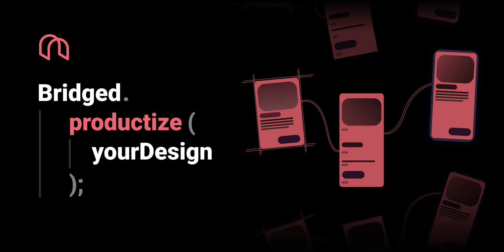

  <meta name="description" content="figma to flutter code exporter, lint your design. generate human level quality code from figma">
  <meta name="title" content="bridged assistant">

# Bridged Assistant figma plugin (figma to flutter)

## Usage

> link is temporarily dead. it's being reviewed by figma team. until this plugin is available publicly, you have to build it on local and run it. guideline at [here](/figma)

install via figma plugin [link here](https://www.figma.com/community/plugin/896445082033423994)

## Flutter code builder

flutter widget builder is done by [figma/flutter](/flutter) and the core builder is powered by [bridged's dynamic](https://github.com/bridgedxyz/dynamic)
- [figma/flutter](/figma/src/flutter)
- [bridgedxyz/flutter-js](https://github.com/bridgedxyz/flutter-builder)
- [bridgedxyz/dynamic](https://github.com/bridgedxyz/dynamic)

- ✅ `Theme.of` Textstyle support
- ✅ `Colors.` Color support
- ✅ Slots support (not static content)
- ✅ Modularized builder functions - (not all-in-one widget tree)
- ✅ formatted dart code
- ✅ Best code quality (I Assure,) in this planet

### Debugging

Use `console.log` statements to inspect values in your code.

To open the developer console in the Figma desktop app, go to `Plugins` → `Development` → `Open Console`.

### Change Log

visit [CHANGELOG.md](./CHANGELOG.md)

### Docs

- [Create Figma Plugin docs](https://github.com/yuanqing/create-figma-plugin#docs)
- [Figma plugin API docs](https://figma.com/plugin-docs/api/)

## Development guide

*This plugin is built with [Create Figma Plugin](https://github.com/yuanqing/create-figma-plugin).*

### Pre-requisites

- [Node.js](https://nodejs.org/)
- [Figma desktop app](https://figma.com/downloads/)

### Building the plugin

See [plugin README](/plugin/README.md)

### LEGAL
> read [LICENSE](./LICENSE).

***to shortly breif,***
- any form of modifing this software, including clone, fork, merge is allowed with no restrictions.
- making profit "by using" this software is allowed with no restrictions.
- making profit "by re-distributing" is not allowed. recap, you cannot publish this plugin as an alternative to this original plugin.
-- why is that? we are taking "minimum" profit from this software, we will prevent from other enterprise from copycatting this software.
- the code and packages distributed via this repository is free to use without any restrictions.
- code, design is free to use and modify. (just don't make any profits by re-distributing this plugin.)

### DISCLAIMER

re-use of this software and it's license is overrided by [contributing-and-license](https://github.com/bridgedxyz/contributing-and-license)
