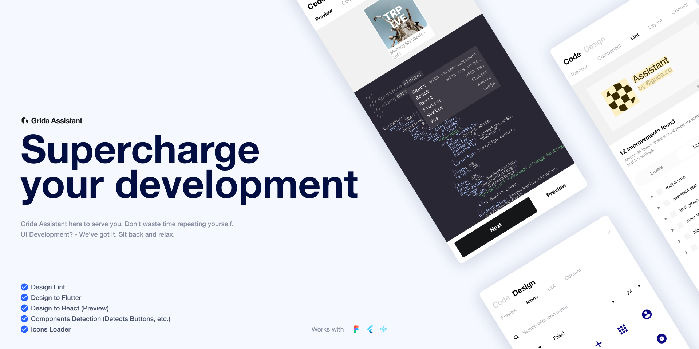

<meta name="description" content="figma to flutter code exporter, lint your design. generate human level quality code from figma">
<meta name="title" content="Grida assistant">




# Grdia Assistant plugin (figma to flutter & react)

> Any design to high quality code, with live preview.


- ✅ Human readable code generation.
- ✅ Code generation built with CoLI, developed especially for assistant usage, ensuring the best code generation quality.
- ✅ Slots support (Component with parameters)
- ✅ Modularized code generation / readability. All production level code, code beign generated as Functions, Varables, Ect..
- ✅ Design Linting - Visaully makes sence, Structure made sence.
- ✅ Cloud Resource Copy. Copy your resource in 1 second. (No need to download images and move under `res/`)
- ✅ Live preview via [console](https://console.grida.co) - compiles output source remotely makes design to living application within seconds
- ✅ Context detection - Grida assistant understands the design, than converts it into a hight quality code. we don't generate rect and text code for a button. We generate button code for a button.

## Usage

> Install figma plugin via below link. Note that the published plugin is always behind few new features behind this repository. For trying out the latest and mindblowing features, please build from your local environment directly.

Install via figma plugin [link here](https://www.figma.com/community/plugin/896445082033423994).

### Cloning and running the project:

> - We use yarn workspace for maintaining this project as monorepo.
> - Some additional steps are required to run this project properly.

```shell
# [REQUIRED] we use git submodules for `packages/`. you have to explicitly execute this command instead default clone.
git clone --recurse-submodules https://github.com/gridaco/assistant.git

cd assistant

# [REQUIRED] Yarn will install dependencies, link packages, and generate compiled code of packages, so it can be referenced by root projects.
yarn

# [OPTIONAL 1] Run figma plugin in dev mode (use localhost server) (recommanded)
yarn figma

# [OPTIONAL 1-2] Run figma plugin in dev mode (native)
yarn figma-native

# [OPTIONAL 2] Run sketch plugin in dev mode
yarn sketch

# [OPTIONAL 3 & Contributors only] Run plugin ui in webdev mode
yarn web
# visit http://localhost:3303/init-webdev to work on browser
```

_Soon as the subpackages are released as stable, we will remove git submodule dependency for ease of use. until then, this will be the primary repository and all the edits and PRs will be caused by this project._ - [Learn more here](https://github.com/bridgedxyz/.github/blob/main/contributing/working-with-submodules.md)

> Sometimes, when pulling this repo from remote, if new submodule package is added, you'll need to run below command to pull with updated submodules (we recommand you to know what this command actually does in a nut shell.)

```shell
git submodule update --init --recursive
```

### Pre-requisites

- [Node.js](https://nodejs.org/)
- [Figma desktop app](https://figma.com/downloads/)

## Flutter code builder

flutter widget builder is done by [figma/flutter](/flutter) and the core builder is powered by [Grida dynamic](https://github.com/bridgedxyz/dynamic)

- [figma/flutter](/figma/src/flutter)
- [grida/flutter-builder](https://github.com/bridgedxyz/flutter-builder)
- [grida/dynamic](https://github.com/bridgedxyz/dynamic)
- ✅ `Theme.of` Textstyle support
- ✅ `Colors.` Color support
- ✅ Slots support (not static content)
- ✅ Modularized builder functions - (not all-in-one widget tree)
- ✅ Formatted Dart code
- ✅ Best code quality (I Assure,) in this planet

## Console & Cloud integrations

> Watch the demo on our [website](https://grida.co)

Grida console integrated with assistant enables you to manage your design's content in one place. even if text, image is updated, you don't need to update your code. our cloud service got your back.

Learn more at [console repository](https://github.com/gridaco/console.grida.co)

## UI Element Detection

> Rule based button / input / icon detection with [@reflect-ui/detection](./packages/detection)
> Higher quality ML based detection available at [Grida's context engine](https://github.com/bridgedxyz/context)

## Design Assistant

> We provide various tools for you for creating stauning designs, and making you 10 times faster to create a working prototype.

**Features**

- **icons loader** (Design Tab ➡️ Icons)

  

  - 5,000 + [material design icons](https://github.com/reflect-ui/reflect-icons)
  - 800 + [ant design icons](https://github.com/reflect-ui/reflect-icons)
  - Read our blog about Icons Loader feature on [medium](https://medium.com/bridgedxyz/bridged-assistant-update-2021-0-1f1-meet-powerful-bridged-design-assistants-icon-loader-552b452396a4)

- fonts replacer
- buttons generator
- and more

## Development guide

### Building the plugin

- Figma: See [plugin README](/figma/README.md)
- Sketch: `Sketch platform will be available soon`

### Running as Webdev

> `webdev` is a mode that you can run assistant as a standalone appliaction for ui development purpose of its' you can't acccess or call api to design tools.

Learn more at [./webdev](./webdev)

```sh
yarn

# on root
yarn webdev

# or..
cd webdev
yarn start
```

### Debugging

Use `console.log` statements to inspect values in your code.

To open the developer console in the Figma desktop app, go to `Plugins` → `Development` → `Open Console`.

### Docs

- [Create Figma Plugin docs](https://github.com/yuanqing/create-figma-plugin#docs)
- [Figma plugin API docs](https://figma.com/plugin-docs/api/)

## Contributing & Project Structure

**general**
See this project's contributing guideline and technical overview [here](./CONTRIBUTING.md).
And general Grida project contribution and collaboration guideline [here](https://github.com/bridgedxyz/contributing-and-license).

**supported platforms and frameworks**

- ✅ [Figma](./figma)
- ✅ [Flutter](./core)
- ✅ [Grida Web](https://github.com/gridaco/console.grida.co)
- [Sketch](./sketch) -- Coming Soon
- React -- Coming Soon & Under [Development](https://github.com/bridgedxyz/web-builder)
- Vue -- Coming Soon & Under [Development](https://github.com/bridgedxyz/web-builder)
- CSS/SASS -- Coming Soon & Under [Development](https://github.com/bridgedxyz/web-builder)
- [Adobe XD](./xd) -- Coming Soon
- [Zeplin](./zeplin) -- Coming Soon

## Changelog

we release new updates in a by-monthluy cycle. Watch this repository on github or signup for our news letters on [grida.co](https://grida.co)

All update logs available at [CHANGELOG.md](./CHANGELOG.md)

## Blogs

- [Flutter force week 103](https://medium.com/flutterforce/flutterforce-week-103-95b0822ef25f)
- [Flutter force week 135](https://medium.com/flutterforce/flutterforce-week-135-d28b8741302a)
- [Assistant initial release](https://blog.grida.co/assistant-initial-release-f75d0084df9c)
- [Introducng Grida Assistant 2021.8.0b](https://blog.grida.co/figma-assistant-by-grida-supercharge-your-design-development-workflow-e6b2989216e2)

## LEGAL

> read [LICENSE](./LICENSE).

**_to shortly brief,_**

- Any form of modifing this software, including clone, fork, merge is allowed with no restrictions.
- Making profit "by using" this software is allowed with no restrictions.
- Making profit "by re-distributing" is not allowed. Recap, you cannot publish this plugin as an alternative to this original plugin.
  -- Why is that? We are taking "minimum" profit from this software, we will prevent from other enterprise from copycatting this software.
- The code and packages distributed via this repository is free to use without any restrictions.
- The code and design is free to use and modify. (Just don't make any profits by re-distributing this plugin.)

### DISCLAIMER

Re-use of this software and it's license is overrided by [contributing-and-license](https://github.com/bridgedxyz/contributing-and-license)
