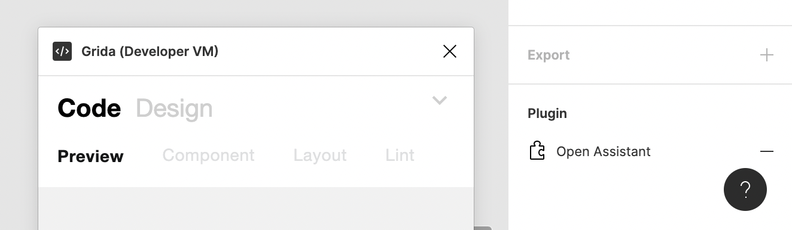

# Relaunch data management

1. initially, set the relaunce data on root page node for ux & plugin suggestion.

### References

- https://www.figma.com/plugin-docs/api/properties/nodes-setrelaunchdata/
- https://www.figma.com/plugin-docs/manifest/#relaunchbuttons
